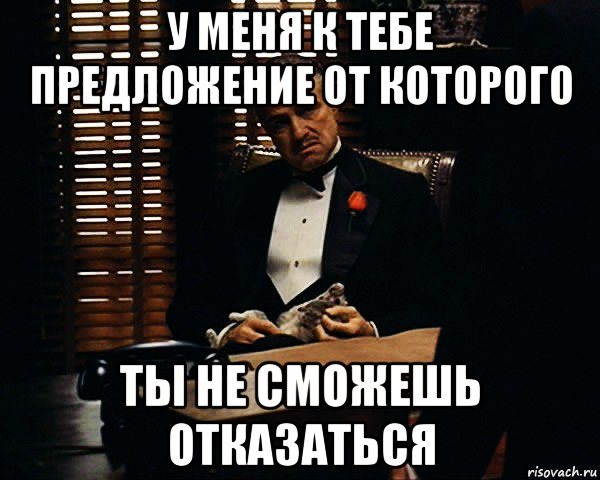

# ИНСТРУКЦИЯ ПО РАБОТЕ С MARKDOWN

## выделение текста

> выделение текста курсивом осуществляется с помощью обрамления символом " * " или знаком нижнего подчёркивания "_". например *так* или _так_

> выделение текста полужирным шрифтом - "**" или двойным знаком нижнего подчёркивания "__", например **вот так** или __вот так__

> комбинация курсива и полужирного текста выполняется с помощью сочетания символов нижнего подчёркивания и двойной звёздочки "_**". Например _**text**_
## списки
чтобы добавить элемент в список используйте символ "*"

## работа с изображениями
> для того чтобы вставить изображение, следует использовать вот такую конструкцию "". Например 
 

## ссылки

## работа с таблицами

## цитаты

## ЗАКЛЮЧЕНИЕ