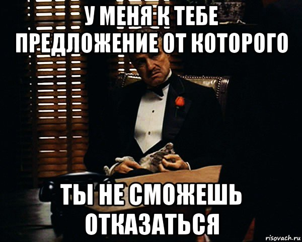

# ИНСТРУКЦИЯ ПО РАБОТЕ С MARKDOWN

## выделение текста

> выделение текста курсивом осуществляется с помощью обрамления символом " * " или знаком нижнего подчёркивания "_". например *так* или _так_

> выделение текста полужирным шрифтом - "**" или двойным знаком нижнего подчёркивания "__", например **вот так** или __вот так__

> комбинация курсива и полужирного текста выполняется с помощью сочетания символов нижнего подчёркивания и двойной звёздочки "_**". Например _**text**

> для того чтобы сделать текст зачёркнутым
используется символ " ~~ ". ~~например вот так~~
> сочетанием вышеперечисленных способов можно создать зачеркнутый полужирный текст курсивом. К примеру так: _~~**text**~~_
## списки

> чтобы добавить ненумерованные списки, необходимо пункты выделить звёздочкой (*) или знаком "+", например
* элемент 1
* элемент 2
* элемент 3
+ элемент 4

>Для создания нумерованного списка достаточно перед пронумеровать пункты. К примеру так:
1. пункт 1
2. пункт 2
3. пункт 3
## работа с изображениями
> для того чтобы вставить изображение, следует использовать вот такую конструкцию "". Например 
 

## ссылки
>Чтобы поставить гиперссылку без анкора, нужно взять URL в угловые скобки. с адресом электронной почты аналогично. Если вставлять с анкором, то тогда текст ссылки заключается в квадратные скобки, а адрес страницы - в круглые. Рядом с URL можно прописать тайтл (на что ведёт ссылка), его обьявляют в кавычках и оставляют с адресом в круглых скобках)
+ Это [ссылка](http://alexgyver.ru "AlexGyver") с тайтлом
+ [эта ссылка](http://alexgyver.ru) без тайтла
+ <https://alexgyver.ru/> безанкорная (неприкрытая) ссылка
## работа с таблицами
для работы с таблицами необходимо

## ЗАКЛЮЧЕНИЕ